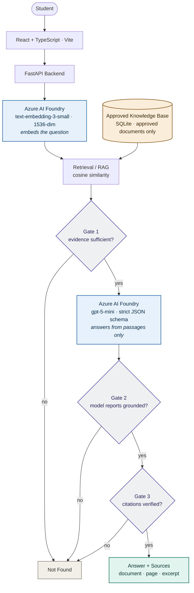
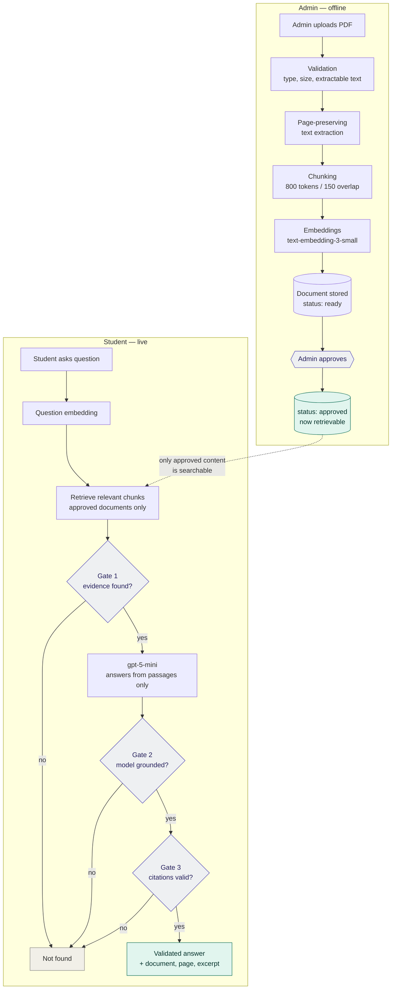
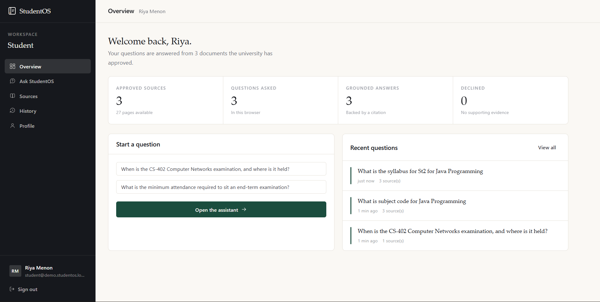
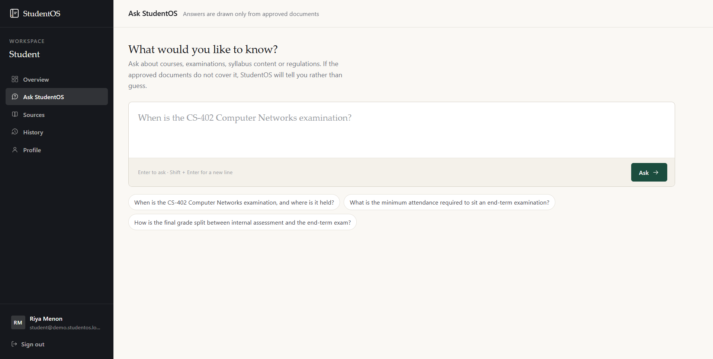
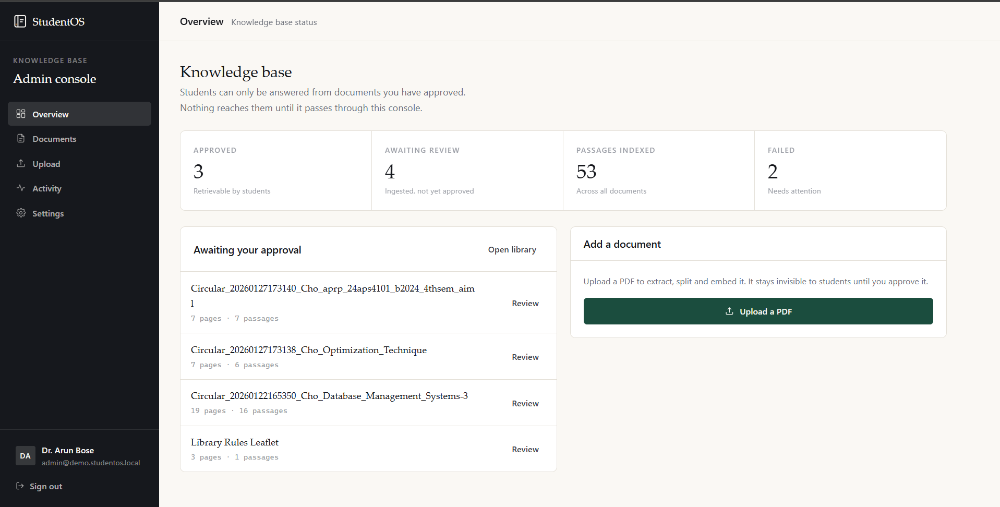
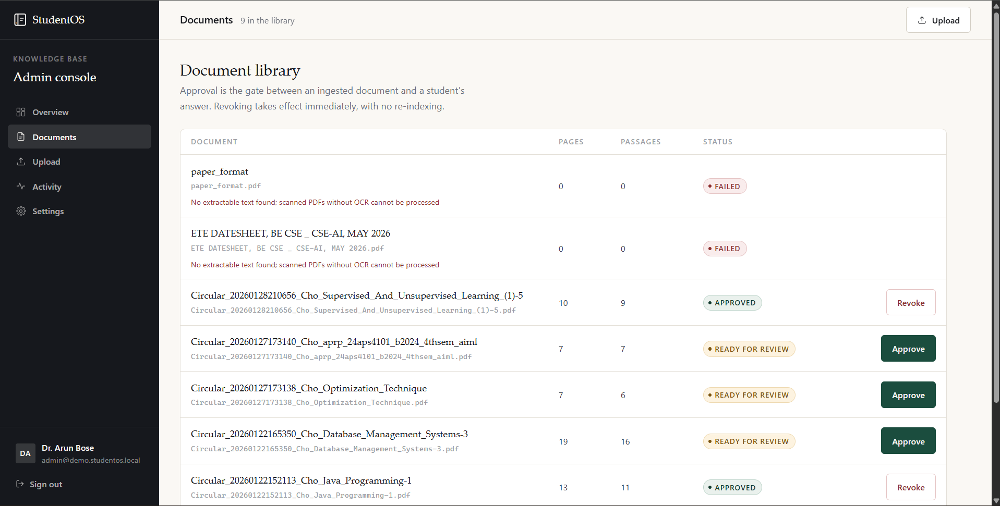

# StudentOS

**AI-powered university student assistant that answers only from approved university documents — with page-level citations, and an explicit "not found" when the evidence isn't there.**

[](#testing)
[](#technology-stack)
[](#technology-stack)
[](#technology-stack)

---

## Project Overview

Students waste time hunting through handbooks, circulars and datesheets for answers that are technically written down somewhere. A general-purpose chatbot doesn't solve this — it will happily invent an exam date.

StudentOS is deliberately **not** a general-purpose chatbot. It makes one guarantee:

> If the answer is in the approved knowledge base, StudentOS finds it and cites the page.
> If it isn't, StudentOS says so — it never invents university-specific facts.

The refusal is the product. A confidently wrong exam date is worse than no answer, because a student acts on it.

**How the guarantee is enforced:** an administrator approves each document before it is retrievable, and every answer passes three independent grounding gates. Two of those gates are ordinary backend code rather than model calls, so the guarantee holds even when the model misbehaves.

### Example

**Student:** *"When is the CS-402 Computer Networks exam, and where is it held?"*

> CS-402 Computer Networks end-term exam is on 14 December 2026, 10:00–13:00, held in Examination Hall 1.
>
> **Grounded in approved documents**
> `CS Department Student Handbook, Autumn 2026` · Pages 1–2 · similarity 0.697

**Student:** *"What is the campus parking fee for electric motorcycles?"*

> Information not found in the approved university documents.
>
> **Gate 1 — stopped.** No passage cleared the similarity threshold, so the model was never called.

---

## Key Features

| Feature | Description |
|---|---|
| **Approval-gated retrieval** | Only documents an admin has approved are searchable. Revoking takes effect immediately, with no re-indexing. |
| **Three grounding gates** | Gate 1 (pre-model evidence check), Gate 2 (model self-report), Gate 3 (deterministic citation verification). |
| **Page-level citations** | Every answer names the document, page range and supporting excerpt. |
| **Honest not-found** | A designed refusal state showing which gate stopped the query — not an error box. |
| **PDF ingestion pipeline** | Validation, page-preserving extraction, token-based chunking, embedding, storage. |
| **OCR fallback** | A scanned PDF with no text layer is read via OCR, page by page, and enters the same pipeline. Documents with a text layer never touch OCR. |
| **Admin console** | Upload, ingestion progress, document library, approve/revoke, status tracking. |
| **Student workspace** | Question composer, retrieval progress, cited answers, source expansion, history. |
| **Fail-closed design** | An upstream failure degrades to a refusal, never to an unsupported answer. |

---

## Technology Stack

| Layer | Technology |
|---|---|
| **Frontend** | React 18 · TypeScript 5.6 · Vite 6 |
| **Backend** | Python 3.13 · FastAPI · Uvicorn · Pydantic |
| **AI runtime** | Azure AI Foundry |
| **Answer model** | `gpt-5-mini` (Responses API, strict JSON schema) |
| **Embedding model** | `text-embedding-3-small` (1536 dimensions) |
| **Approach** | RAG — retrieval-augmented generation, single-pass, no agent loop |
| **Storage** | SQLite (local prototype storage behind a swappable store interface) |
| **PDF processing** | pypdf |
| **OCR (scanned PDFs)** | Azure AI Document Intelligence `prebuilt-read` — fallback only, on the same AIServices resource |
| **Tokenization** | tiktoken (`cl100k_base`) |
| **Authentication (Azure)** | Microsoft Entra ID via `DefaultAzureCredential` — no API key in the repo |
| **Testing** | pytest |

### Tool boundaries

These are conceptually separate and must not blur:

| Tool | Role | Runs at |
|---|---|---|
| **Azure AI Foundry** | Runtime AI — chat and embedding models | **Runtime** |
| **Claude Code** | Development and coding assistant | **Development only — not part of the StudentOS runtime** |
| **GitHub** | Source control | Development |

> **Note:** Claude Code was used as a development/coding assistant while building this project. It is **not** a dependency, is **not** called at runtime, and is **not** part of the StudentOS request path. All runtime AI is served by Azure AI Foundry.

---

## Project Structure

```
StudentOS/
├── backend/
│   ├── foundry/              Azure AI Foundry clients (sole holder of model access)
│   │   ├── chat.py             gpt-5-mini, strict JSON schema output
│   │   └── embeddings.py       text-embedding-3-small, 1536-dim
│   ├── ingestion/            PDF → pages → chunks pipeline
│   │   ├── pdf.py              validation + page-preserving extraction
│   │   ├── chunker.py          800/150 token chunking, deterministic chunk IDs
│   │   └── pipeline.py         orchestration + failure unwinding
│   ├── routes/               FastAPI endpoints
│   │   ├── admin.py            upload, approve, revoke, list
│   │   ├── chat.py             student question endpoint
│   │   └── health.py
│   ├── services/
│   │   ├── answering.py        the three grounding gates
│   │   ├── sqlite_store.py     storage + cosine similarity retrieval
│   │   └── store.py            storage interface
│   ├── config.py             settings + version-controlled pipeline config
│   └── main.py               app factory
├── frontend/
│   └── src/
│       ├── pages/              landing, auth, student, admin
│       ├── components/         Shell, AnswerPanel, StatusChip, icons
│       ├── lib/                auth, router, history
│       ├── styles/             design tokens + stylesheet
│       └── api.ts              typed backend client
├── tests/                    120 tests (pytest)
│   ├── ingestion/              extraction, chunking, embeddings, persistence
│   └── test_demo_flow.py       end-to-end: ingest → approve → ask → gates
├── scripts/
│   ├── demo.py                 end-to-end demo against live Foundry
│   ├── ingest.py               CLI ingestion
│   └── generate_demo_pdf.py    synthetic demo document generator
├── sample-data/              synthetic university documents (clearly labelled)
├── migrations/               Postgres schema SQL (written, not applied — see Limitations)
├── config/
│   └── retrieval.yaml        thresholds, tokenizer, chunking params
└── docs/                     architecture, requirements, ADRs
```

---

## System Architecture



**Why three gates:** Gate 1 and Gate 3 are plain backend code, not model calls. Gate 1 runs *before* any model call, so an unanswerable question costs nothing and cannot be hallucinated. Gate 3 runs *after*, and rejects any citation that does not resolve to a passage actually retrieved for that query from a still-approved document — so a fabricated reference cannot reach a student.

---

## System Workflow



A document that fails ingestion is recorded as `failed` with a readable reason rather than silently disappearing, and partial chunks are cleaned up. A document only reaches `ready` once **all** chunks and embeddings are stored.

---

## Screenshots

### Student — Workspace Overview



The student's landing view. The header states plainly how many approved documents back its answers, and the counters separate **grounded answers** from **declined** ones — the refusal is tracked as a first-class outcome, not hidden as an error.

### Student — Ask StudentOS



The question composer, with suggested prompts. The subtitle sets the expectation up front: *"If the approved documents do not cover it, StudentOS will tell you rather than guess."*

### Admin — Knowledge Base Overview



The admin console. Documents sit in **Awaiting review** after ingestion and are invisible to students until approved — approval is a deliberate, separate step from upload.

### Admin — Document Library



The full document lifecycle in one view: **approved** documents with a *Revoke* action, **ready for review** documents with *Approve*, and **failed** ingestions showing the reason. The two failures here are scanned PDFs, captured before OCR support was added — surfaced explicitly rather than stored as empty documents. Re-uploading them now routes them through the OCR fallback.

---

## How It Works

**Document ingestion.** A PDF is validated by content sniffing (not file extension) and rejected if encrypted, then split page by page so page numbers survive. If the PDF carries no text layer — a scan — it falls back to OCR, which returns text per page and enters the identical downstream pipeline; nothing after extraction knows or cares which path the text came from. Text is chunked at 800 tokens with 150 tokens of overlap using `tiktoken`/`cl100k_base`, and each chunk gets a deterministic ID scoped to its document.

**Retrieval.** The student's question is embedded with the same model used for the documents, then compared by cosine similarity against chunks of **approved documents only**. The top 8 are retrieved and the best 5 are passed to the model.

**Foundry model.** `gpt-5-mini` is called once — no agent loop — with a strict JSON schema requiring `grounded`, `answer` and `citations`. Retrieved passages appear only in the user message inside explicit delimiters, never in the system prompt: document content is treated as untrusted data, not instructions.

**Grounding.** Gate 1 refuses before the model is called if no passage clears the similarity threshold. Gate 2 honours the model's own `grounded` flag. Gate 3 independently verifies each returned citation.

**Citations.** A citation survives only if it names a chunk actually retrieved for this query, whose document is *still* approved at validation time, and which carries valid page information. Anything else is dropped; if nothing survives, the answer becomes a not-found.

---

## Run Locally

### Prerequisites

- Python **3.13+**
- Node.js **18+**
- An Azure AI Foundry resource with `gpt-5-mini` and `text-embedding-3-small` deployments
- Azure CLI, signed in (`az login`) with the **Cognitive Services User** role on that resource

### 1. Clone and configure

```bash
git clone https://github.com/SarthakKanwar/StudentOS-AI.git
cd StudentOS-AI
cp .env.example .env
```

Set your Foundry values in `.env`:

```
FOUNDRY_ENDPOINT=https://<your-resource>.cognitiveservices.azure.com
FOUNDRY_API_VERSION=preview
FOUNDRY_CHAT_DEPLOYMENT=gpt-5-mini
FOUNDRY_EMBEDDING_DEPLOYMENT=text-embedding-3-small
```

> **Never commit `.env`.** It is gitignored. Authentication uses Microsoft Entra ID, so **no API key is required or stored** — access comes from your `az login` session.

### 2. Backend

```bash
python -m venv .venv && .venv/Scripts/activate
pip install -e ".[dev]"
python -m uvicorn backend.main:app --port 8000
```

### 3. Frontend

```bash
cd frontend && npm install && npm run dev
```

Open **http://localhost:5173**.

### 4. Demo accounts

Prototype authentication is browser-local. Credentials are shown on the sign-in page:

| Role | Email | Password |
|---|---|---|
| Student | `student@demo.studentos.local` | `demo-student-2026` |
| Administrator | `admin@demo.studentos.local` | `demo-admin-2026` |

### 5. Try the demo flow

```bash
python scripts/generate_demo_pdf.py
```

Then upload `sample-data/cs-department-handbook.pdf` in the admin console, approve it, and ask as a student:

- *"When is the CS-402 Computer Networks examination, and where is it held?"* → grounded answer with a page citation
- *"What is the campus parking fee for electric motorcycles?"* → explicit not-found

Or run the whole flow headlessly against live Foundry:

```bash
python scripts/demo.py
```

---

## Testing

| Check | Command | Status |
|---|---|---|
| Backend test suite | `pytest tests/ -q` | **120 passed** |
| Frontend TypeScript | `npx tsc -b` | **Passed** |
| Frontend production build | `npm run build` | **Passed** |

External services are mocked in unit tests — no Azure call is made and no cost is incurred. `tests/test_demo_flow.py` covers the full path end to end: ingest → approve → retrieve → all three gates, including that a **fabricated citation cannot pass Gate 3** and that revoking approval immediately stops retrieval.

---

## Limitations / Future Scope

| Area | Current state |
|---|---|
| **Storage** | SQLite is used for the prototype. A Postgres + pgvector schema exists in `migrations/` but has **not** been applied; the store interface allows swapping it in later. |
| **OCR accuracy** | Scanned PDFs are now read via OCR, but OCR output is inherently lower-confidence than an embedded text layer. Accuracy has not been measured against a labelled set, and a poor scan can still fail — explicitly, with a readable reason. |
| **Authentication** | Browser-local prototype auth only. The admin API endpoints are **not** access-controlled — production hardening is required before any real deployment. |
| **Threshold calibration** | `tau_min = 0.35` is an unvalidated starting value (`config/retrieval.yaml` records this as `uncalibrated`). It must be calibrated against an evaluation set before results are presented as validated. |
| **Answer latency** | 15–25 s per question, since `gpt-5-mini` reasons before replying. |

---

## Documentation

| Document | Contents |
|---|---|
| [architecture.md](docs/architecture.md) | System design, request flow, document pipeline, data model, API boundaries |
| [requirements.md](docs/requirements.md) | Functional and non-functional requirements, MVP scope |
| [grounding-strategy.md](docs/grounding-strategy.md) | The three gates, not-found design, threshold calibration |
| [security.md](docs/security.md) | Threat model, prompt-injection defences, fail-closed behaviour |
| [evaluation.md](docs/evaluation.md) | Test categories, metrics, evaluation set design |
| [cost-strategy.md](docs/cost-strategy.md) | Budget, per-query cost, cost controls |
| [project-plan.md](docs/project-plan.md) | Milestones, risks, open decisions |
| [decisions/](docs/decisions/) | Architecture decision records (ADR-002 … ADR-012) |

**Key decisions:** [RAG over fine-tuning](docs/decisions/ADR-002-rag-over-finetuning.md) · [Foundry is the runtime, Claude Code is development-only](docs/decisions/ADR-003-foundry-runtime-boundary.md) · [Document content is untrusted](docs/decisions/ADR-005-document-content-is-untrusted.md) · [Three-gate grounding](docs/decisions/ADR-006-three-gate-grounding.md) · [Page-level citations](docs/decisions/ADR-008-citation-granularity.md) · [Single-pass, no agent loop](docs/decisions/ADR-009-single-pass-no-agents.md)

---

## Security Note

All documents in `sample-data/` are **synthetic** and clearly labelled. No real student records or university documents are included in this repository. `.env` is gitignored; `.env.example` contains variable names and placeholders only. Azure access uses Entra ID, so no model API key exists anywhere in the codebase.
